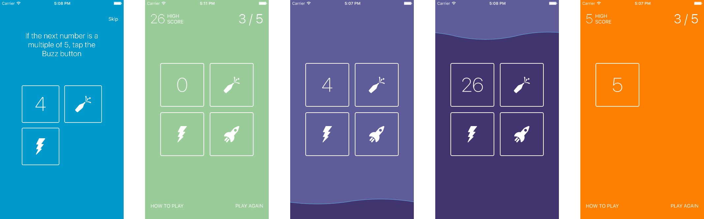
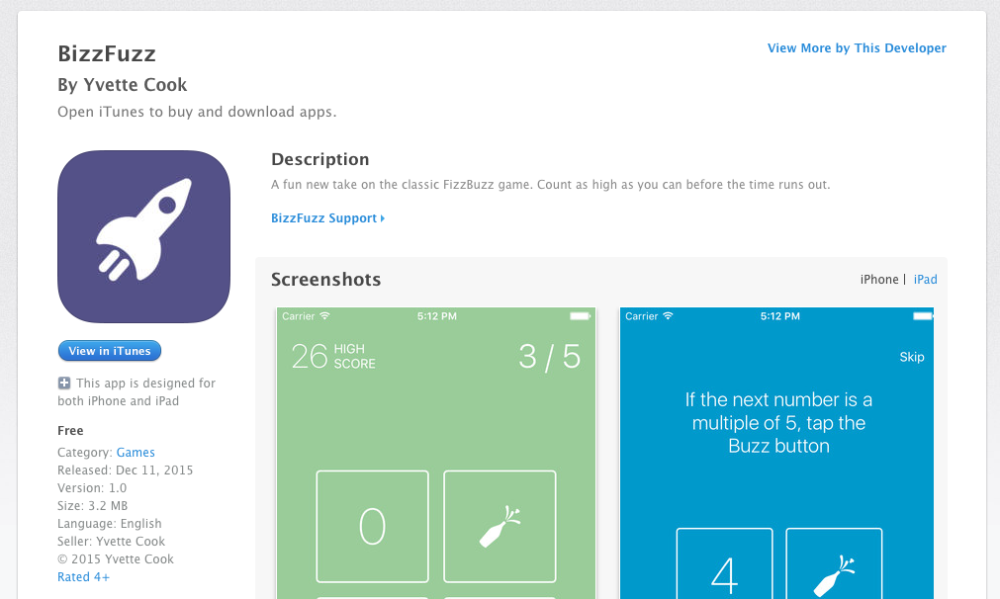

## BizzFuzz

A fun new take on the classic FizzBuzz game. Count as high as you can before the time runs out.

This app was built in preparation to write [Getting Started with TDD in Swift](https://medium.com/@ynzc/getting-started-with-tdd-in-swift-2fab3e07204b#.uh574p43m) tutorial, which is a fun, interactive introduction to building a iOS using native testing tools.

The app is available to download free from the [App Store](https://itunes.apple.com/us/app/bizzfuzz/id1065354200?mt=8)

### Key Skills

* Test Driven Development
* XCTest and UITest
* Swift
* App Store submission process
